<h3><code>marco@github ~ $ ./contributions.sh</code></h3>

  

<h3><code>marco@github ~ $ whoami</code></h3>
<table>
  <tr>
    <td valign="top"></td>
    <td valign="top"></td>
  </tr>
</table>

 

### Stack

HTML · CSS · JavaScript · TypeScript · React · WordPress · Wix Studio · Firebase · Supabase · SQL Server

### Currently

🔭 Pesquisa e desenvolvimento assistivo no **CINTESP.Br** (Centro de Referência Brasileiro em Inovação de Tecnologia Assistiva)
🦽 Expandindo um simulador de cadeira de rodas em VR (rastreamento corporal, Quest 2)
♿ Focado em acessibilidade, responsividade e inclusão de pessoas com deficiência

### Find me

[LinkedIn](https://www.linkedin.com/in/marco-t%C3%BAlio-rodrigues-19962020a) · [Portfolio](https://myportfolio-ruddy-sigma.vercel.app/)

Portrait, info card and contribution graph above are self-contained animated SVGs, regenerated daily by a GitHub Actions workflow — no third-party stats service, no API token, no client-side JS.
